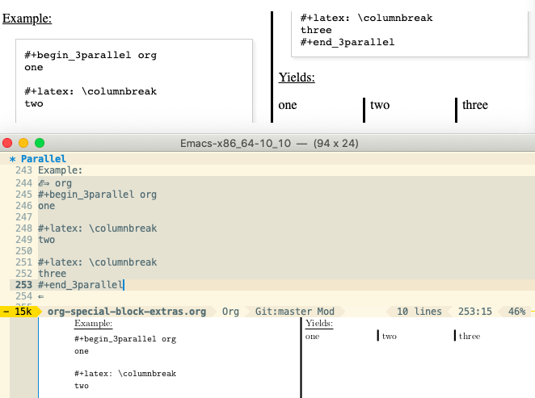
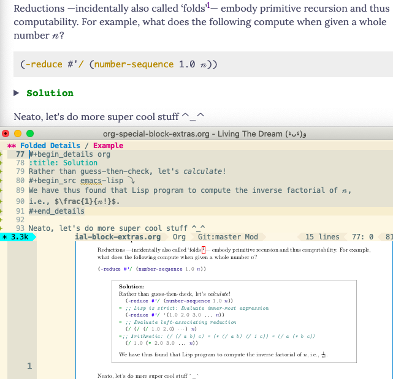
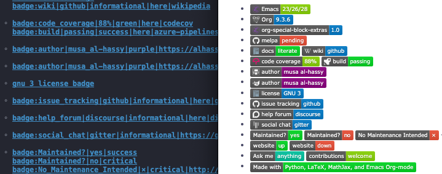

Twenty-eight new custom block and 30 link types for Emacs' Org-mode ^\_^

,# +TOC: headlines 2

***Warning: Incomplete!***

**Abstract**

> The aim is to write something once using Org-mode markup
> then generate the markup for multiple backends.
> That is, ***write once, generate many!***
>
> In particular, we are concerned with *‘custom’, or ‘special’, blocks* which
> delimit how a particular region of text is supposed to be formatted according to
> the possible export backends.  In some sense, special blocks are meta-blocks.
> Rather than writing text in, say, LaTeX environments using LaTeX commands or in
> HTML `div`'s using HTML tags, we promote using Org-mode markup in special blocks
> &#x2014;Org markup cannot be used explicitly within HTML or LaTeX environments.
>
> Consequently, we extend the number of block types available to the Emacs
> Org-mode user **without forcing the user** to learn HTML or LaTeX.
> Indeed, I am not a web developer and had to learn a number of HTML concepts
> in the process &#x2014;the average Org user should not have to do so.
>
> Similarly, we provide a number of ‘link types’ `[[linktype:label][description]]`
> for producing in-line coloured text and SVG “badges”.
>
> We begin with the first two sections serving as mini-tutorials on special blocks
> and on link types. The special block setup we use is *extensible* in that a new
> block named `𝒞` will automatically be supported if the user defines a function
> `org-special-block-extras--𝒞` that formats the text of a block.  \*The remaining
> sections are literate implementation matter, along with examples and
> screenshots.\*
>
> In summary, we provide 20 colour block types and 20 colour link types,
> an ‘editor comment’ block type as well as a link type,
> a ‘details’ block type, a ‘parallel’ multiple columns view block type,
> a ‘link here’ link type, and 8 badge link types.
> That is, **we provide 28 block types and 30 link types**.

( Since we're only considering HTML & LaTeX, the Github rendition of this
article may not render things as desired. )

> The full article may be read as a [PDF](https://alhassy.github.io/org-special-block-extras/README.pdf) or as [HTML](https://alhassy.github.io/org-special-block-extras/README.html) or as pure [Org](https:/raw.githubusercontent.com/alhassy/org-special-block-extras/master/org-special-block-extras.org)!

> The full article may be read as a [PDF](https://alhassy.github.io/org-special-block-extras/README.pdf) or as [HTML](https://alhassy.github.io/org-special-block-extras/README.html) or as pure [Org](https:/raw.githubusercontent.com/alhassy/org-special-block-extras/master/org-special-block-extras.org)!

# Table of Contents
