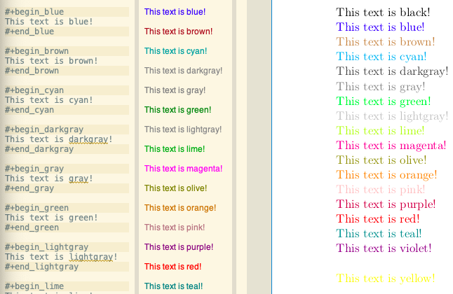

<h1> 29 new custom blocks and 32 link types for Emacs' Org-mode (•̀ᴗ•́)و </h1>

***Warning: Incomplete!***

**Abstract**

> The aim is to write something once using Org-mode markup
> then generate the markup for multiple backends.
> That is, ***write once, generate many!***
>
> In particular, we are concerned with *‘custom’, or ‘special’, blocks* which
> delimit how a particular region of text is supposed to be formatted according to
> the possible export backends.  In some sense, special blocks are meta-blocks.
> Rather than writing text in, say, LaTeX environments using LaTeX commands or in
> HTML `div`'s using HTML tags, we promote using Org-mode markup in special blocks
> &#x2014;Org markup cannot be used explicitly within HTML or LaTeX environments.
>
> Consequently, we extend the number of block types available to the Emacs
> Org-mode user **without forcing the user** to learn HTML or LaTeX.
> Indeed, I am not a web developer and had to learn a number of HTML concepts
> in the process &#x2014;the average Org user should not have to do so.
>
> Similarly, we provide a number of ‘link types’ `[[linktype:label][description]]`
> for producing in-line coloured text and SVG “badges”.
>
> We begin with the first two sections serving as mini-tutorials on special blocks
> and on link types. The special block setup we use is *extensible* in that a new
> block named `𝒞` will automatically be supported if the user defines a function
> `org-special-block-extras--𝒞` that formats the text of a block.  \*The remaining
> sections are literate implementation matter, along with examples and
> screenshots.\*
>
> In summary, we provide 20 colour block types and 20 colour link types,
> an ‘editor comment’ block type as well as a link type,
> a ‘details’ block type, a ‘parallel’ multiple columns view block type,
> a ‘link here’ link type, 8 badge link types,
> and block and link types for making documentation-glossary entries.
> That is, **we provide 29 block types and 32 link types**.

> The full article may be read as a [PDF](https://alhassy.github.io/org-special-block-extras/README.pdf) or as [HTML](https://alhassy.github.io/org-special-block-extras/README.html) or as pure [Org](https:/raw.githubusercontent.com/alhassy/org-special-block-extras/master/org-special-block-extras.org)!
> &#x2014;or visit the [repo](https://github.com/alhassy/org-special-block-extras).

*First, a gallery of what's possible!*

<table border="2" cellspacing="0" cellpadding="6" rules="groups" frame="hsides">

<colgroup>
<col  class="org-left" />
</colgroup>
<tbody>
<tr>
<td class="org-left">**Write Org-markup once, generate for many backends ^\_^**</td>
</tr>
</tbody>
</table>

<table border="2" cellspacing="0" cellpadding="6" rules="groups" frame="hsides">

<colgroup>
<col  class="org-left" />
</colgroup>
<tbody>
<tr>
<td class="org-left">**Displaying thoughts side-by-side ^\_^**</td>
</tr>
</tbody>
</table>

<table border="2" cellspacing="0" cellpadding="6" rules="groups" frame="hsides">

<colgroup>
<col  class="org-left" />
</colgroup>
<tbody>
<tr>
<td class="org-left">**“First-class editor comments” In order: Chrome, Emacs Web Wowser, Org source, PDF**</td>
</tr>
</tbody>
</table>

<table border="2" cellspacing="0" cellpadding="6" rules="groups" frame="hsides">

<colgroup>
<col  class="org-left" />
</colgroup>
<tbody>
<tr>
<td class="org-left">**Visually hiding, folding away, details**</td>
</tr>
</tbody>
</table>

<table border="2" cellspacing="0" cellpadding="6" rules="groups" frame="hsides">

<colgroup>
<col  class="org-left" />
</colgroup>
<tbody>
<tr>
<td class="org-left">**An Emacs interface to <https://shields.io/>**</td>
</tr>
</tbody>
</table>

<table border="2" cellspacing="0" cellpadding="6" rules="groups" frame="hsides">

<colgroup>
<col  class="org-left" />
</colgroup>
<tbody>
<tr>
<td class="org-left">**Tooltips for documentation and glossary items &#x2013;in the browser!**</td>
</tr>
</tbody>
</table>

<table border="2" cellspacing="0" cellpadding="6" rules="groups" frame="hsides">

<colgroup>
<col  class="org-left" />
</colgroup>
<tbody>
<tr>
<td class="org-left">**Tooltips for documentation and glossary items &#x2013;in Emacs!**</td>
</tr>
</tbody>
</table>

<table border="2" cellspacing="0" cellpadding="6" rules="groups" frame="hsides">

<colgroup>
<col  class="org-left" />
</colgroup>
<tbody>
<tr>
<td class="org-left">**Tooltips for documentation and glossary items &#x2013;in the PDF!**</td>
</tr>
</tbody>
</table>

<table border="2" cellspacing="0" cellpadding="6" rules="groups" frame="hsides">

<colgroup>
<col  class="org-left" />
</colgroup>
<tbody>
<tr>
<td class="org-left">**Declaring documentation-glossary items**</td>
</tr>
</tbody>
</table>

> The full article may be read as a [PDF](https://alhassy.github.io/org-special-block-extras/README.pdf) or as [HTML](https://alhassy.github.io/org-special-block-extras/README.html) or as pure [Org](https:/raw.githubusercontent.com/alhassy/org-special-block-extras/master/org-special-block-extras.org)!
> &#x2014;or visit the [repo](https://github.com/alhassy/org-special-block-extras).

# Table of Contents

1.  [Summary](#Summary)
    1.  [Installation Instructions](#Installation-Instructions)
    2.  [Minimal working example](#Minimal-working-example)
    3.  [Bye!](#Bye)

# Summary

Let `𝒞` be any of the following: `black`, `blue`, `brown`, `cyan`, `darkgray`, `gray`, `green`,
`lightgray`, `lime`, `magenta`, `olive orange`, `pink`, `purple`, `red`, `teal`, `violet`, `white`,
`yellow`. Let `𝓃` be any number from `1..5`.

<table border="2" cellspacing="0" cellpadding="6" rules="groups" frame="hsides">

<colgroup>
<col  class="org-left" />

<col  class="org-left" />

<col  class="org-left" />

<col  class="org-left" />
</colgroup>
<thead>
<tr>
<th scope="col" class="org-left">Idea</th>
<th scope="col" class="org-left">Block</th>
<th scope="col" class="org-left">Link</th>
<th scope="col" class="org-left">Switches</th>
</tr>
</thead>

<tbody>
<tr>
<td class="org-left">Colours</td>
<td class="org-left">`𝒞`</td>
<td class="org-left">`𝒞`, `color:𝒞`</td>
<td class="org-left">`:color:`</td>
</tr>

<tr>
<td class="org-left">Parallel</td>
<td class="org-left">`𝓃parallel[NB]`</td>
<td class="org-left">-</td>
<td class="org-left">`:columnbreak:`</td>
</tr>

<tr>
<td class="org-left">Editorial Comments</td>
<td class="org-left">`edcomm`</td>
<td class="org-left">`edcomm`</td>
<td class="org-left">`:ed:`, `:replacewith:`</td>
</tr>

<tr>
<td class="org-left">Folded Details</td>
<td class="org-left">`details`</td>
<td class="org-left">-</td>
<td class="org-left">`:title:`</td>
</tr>

<tr>
<td class="org-left">Link Here</td>
<td class="org-left">-</td>
<td class="org-left">`link-here`</td>
<td class="org-left">-</td>
</tr>

<tr>
<td class="org-left">Badges</td>
<td class="org-left">-</td>
<td class="org-left">`badge`</td>
<td class="org-left">-</td>
</tr>

<tr>
<td class="org-left">Documentation-Glossary</td>
<td class="org-left">`documentation`</td>
<td class="org-left">`doc`, `show`</td>
<td class="org-left">`:name:`, `:label:`</td>
</tr>
</tbody>
</table>

There are also the social badge links:
`reddit-subscribe-to`, `github-followers`, `github-forks`, `github-stars,
github-watchers`, `twitter-follow`, and `tweet`.

Going forward, it'd be nice to a centralised ‘user manual’ which may be
consulted rather than reading the literate implementation above.

## Installation Instructions

    ;; ⟨0⟩ Download the org-special-block-extras.el file manually or using quelpa
    (quelpa '(org-special-block-extras :fetcher github :repo
    "alhassy/org-special-block-extras"))

    ;; ⟨1⟩ Have this always active in Org buffers
    (add-hook #'org-mode-hook #'org-special-block-extras-mode)

    ;; ⟨1′⟩ Or use: “M-x org-special-block-extras-mode” to turn it on/off

## Minimal working example

    #+begin_parallel
    Name this file test.org, then write something like doc:loop
    now press =C-c C-e h o= and your browser will open a pretty
    document. Hover over the previous “loop” and you'll see its
    documentation!

    Now the right column, has a first-class editorial comment
    and an SVG badge.

    #+begin_edcomm
    Super neat stuff!
    #+end_edcomm

    badge:thanks|for_reading

    tweet:https://github.com/alhassy/org-special-block-extras

    badge:|buy_me_a coffee|gray|https://www.buymeacoffee.com/alhassy|buy-me-a-coffee
    #+end_parallel

## Bye!

<thanks|for_reading>

https://twitter.com/intent/tweet?text=This looks super neat (•̀ᴗ•́)و::&url=https://github.com/alhassy/org-special-block-extras

https://www.buymeacoffee.com/alhassy
